```{r setup, include=FALSE}
options(htmltools.dir.version = FALSE)
```
class: inverse, center, middle

# Functional Data Analysis (FDA)

---


# What is Functional Data Analysis?  

- FDA deals with analysing data *that can be considered as* **curves** or **functions**. 

- In FDA, a single observation is a curve or function over some domain. 

- In univariate data analysis, each data point is a single number, $x\in \mathbb{R}$.

- In multivariate data analysis, each data point is a vector of $p$ dimension: 
$$\textbf{X} \in \mathbb{R}^p; \ \ \ \ \  p \in \mathbb{Z}. $$
- In FDA, each data point is assumed to be: 
  - Infinite dimensional function. 
  - Continuous on its domain
  - Can be evaluated at any point on the domain. 

- In reality the domain can be: the real line $\mathbb{R}$, $\mathbb{R}^p$ or more complex sets or intervals.


- We focus our attention on functions defined on  $\mathbb{R}$. 

---

# Functional data example

- Daily average temperature between 1980-2009 from 73 weather stations<sup>*</sup>

```{r, eval=T, echo=F, fig.retina = 2, out.width = "100%", fig.align='center'}
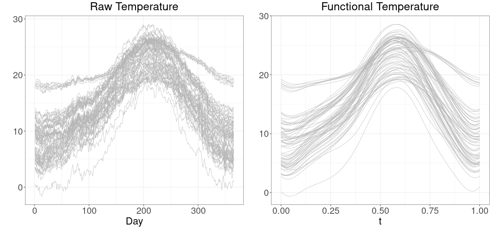
```

.footnote[[*] Data obtained from [fda.usc](https://onlinelibrary.wiley.com/doi/abs/10.1002/env.878) R package.] 

---

# Dealing with functions

- Functions are assumed to be square integrable, defined on the unit interval $[0,1]$: 
$$\int f^2(t)dt = \int_0^1 f(t)^2 < \infty.$$
- Denote by $L^2[0,1]$, the set of all square integrable functions. Then $L^2[0,1]$ is a vector space and we can define the inner product of two functions: 
$$\langle f, g\rangle = \int_0^1 f(t)g(t)dt$$
- Define the norm of a function as the square root of its inner product with itself: 
$$\lVert f \rVert =  \langle f, f\rangle \ = \left( \int_0^1 f(t)^2dt \right)^{1/2}$$

- Now we can measure the distance between two functions $f$ and $g$: 
$$d(f, g) = \lVert f - g\rVert$$


---

# Objectives of FDA

- Rather than random variable, we now deal with **random functions**.
- Each observed function is now a realization of a random function. 
- Just like in univariate and multivariate data analysis: 
  - We can do exploratory analysis and visualization
  - Modelling and hypothesis testing
  - Classification and Clustering

- **Exploratory Analysis** deals with data representation, smoothing, [outlier detection](https://link.springer.com), visualization, dimension reduction using PCA. 

- **Modelling**: deals with regression in functional settings: 
  - scalar on function regression
  - function on function regression etc.
  

- **Classification and Clustering**: deals with classifying and clustering functional observations. 

---
class: inverse, center, middle

# Outlier Detection

---

# What is an outlier in functional setting?

- An outlier is an observation generated by a functional random variable with a different distribution from the one generating the normal observations of a functional sample. <sup>*</sup>
- Since we dealing with functions over a domain: 
  - An outlier can be outlying all through the domain: **persistent outliers**
  - An outlier can be outlying for a small part of the domain. **non-persistent outliers**

- Also a persistent outlier can show different outlying behaviours:
  - **shift/magnitude outlier:** curves with the same shape with *normal observations* but displaced vertically or horizontally away from the mass of the data. 
  
  - **Amplitude outliers:** curves that have similar trend/shape as the majority but with different scale/amplitude (applies mostly to periodic curves). 
  
  - **shape outliers:** curves whose shape differs from the majority

- It is desirable to identify type of a functional outlier.  

.footnote[[*] [Febrero et al. (2008)](https://onlinelibrary.wiley.com/doi/abs/10.1002/env.878)]

---

# Functional outliers examples

```{r, eval=T, echo=F, fig.retina = 2, out.width = "80%", fig.align='center'}
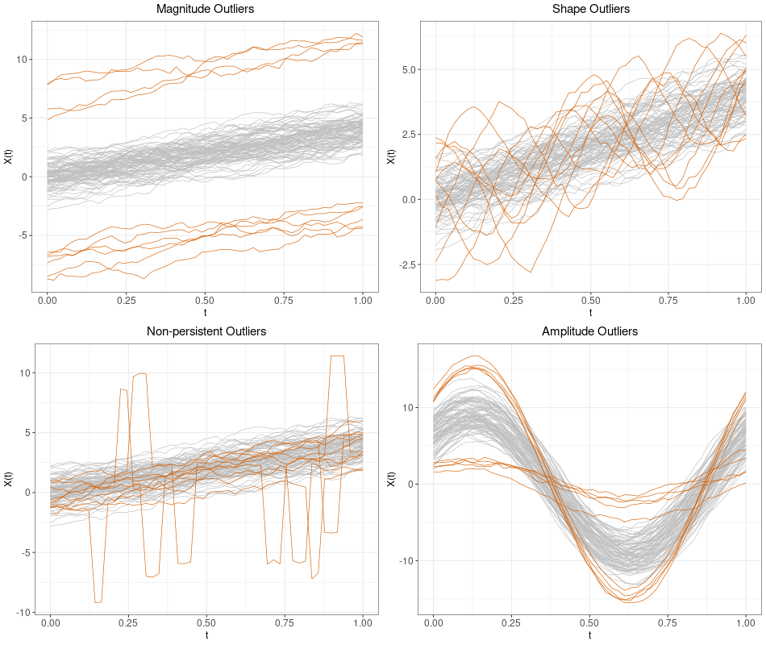
```


---

# Our contribution

- A scalable outlier detection for functional data. 
- Classifies the different types of functional outliers (shape, magnitude, amplitude)
- Classification of outliers is unsupervised. No need for visualization or intervention. 

--


- [Detecting and classifying outliers in big functional data](https://link.springer.com/article/10.1007/s11634-021-00460-9). *Advances in Data Analysis and Classification* (2021)
- Work in collaboration: 
  - Antonio Fernández Anta
  - Rosa Elvira Lillo Rodriguez (UC3M)
  - Carlo Sguera (Formerly UC3M, now SavanaMed)

---

# Two functions: magnitude difference

```{r, eval=T, echo=F, fig.retina = 2, out.width = "90%", fig.align='center'}
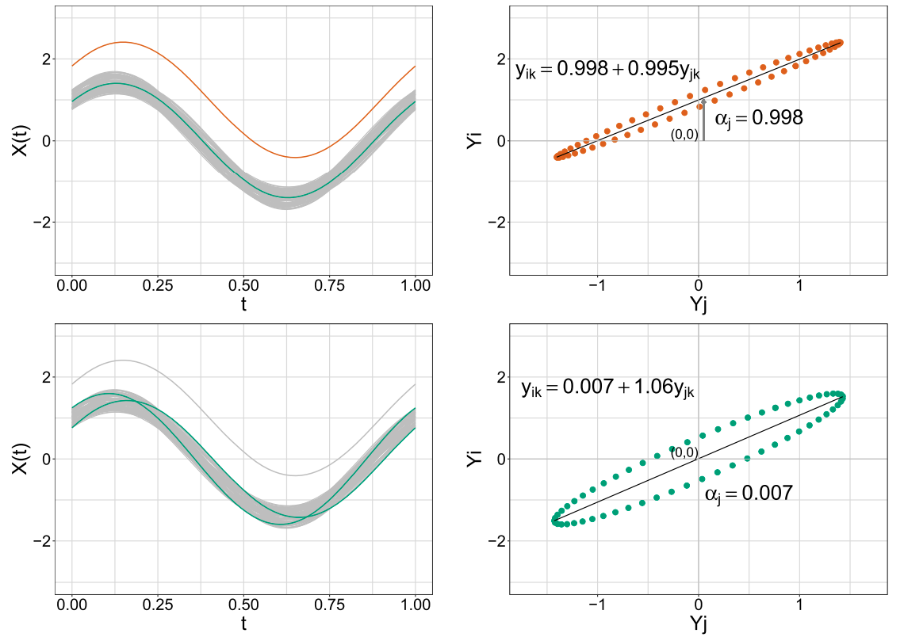
```

---

# Two functions: amplitude difference

```{r, eval=T, echo=F, fig.retina = 2, out.width = "90%", fig.align='center'}
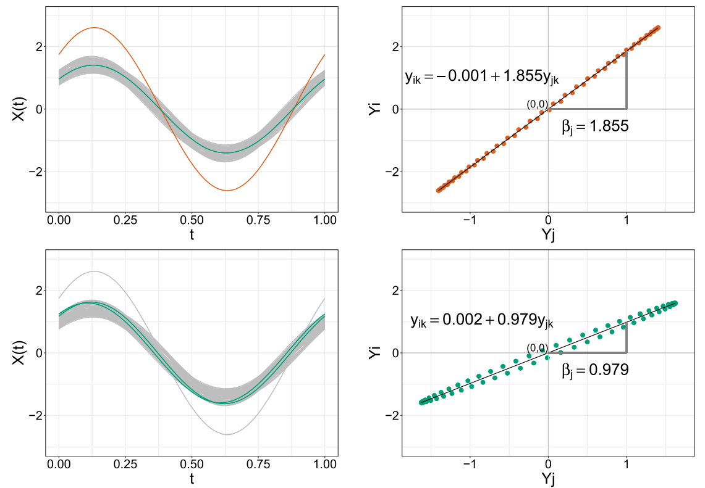
```

---

# Two functions: shape difference

```{r, eval=T, echo=F, fig.retina = 2, out.width = "90%", fig.align='center'}
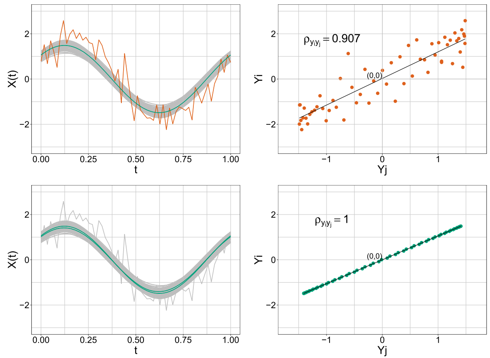
```

---

# Proposal

- We propose two methods that compute three outlyingness indices for each functional observation

- The three outlyingness indices are: 
  - **Amplitude index** denoted by $I_A$,
  - **Magnitude index** (denoted by $I_M$)
  - **Shape index** (denoted by $I_S$)
  
- We call the two methods:
  - **Fast-MUOD**
  - **Semifast-MUOD**. 

---

# Fast-MUOD

- Let $Y = \{Y_1(t), Y_2(t), \ldots, Y_n(t)\}$ be the set of functional observations of interest.  

- Denote by $\tilde{Y}(t)$, pointwise median of $Y$ (or any other type of median of $Y$).

- We define the Fast-MUOD shape index of function $Y_i$ w.r.t. to $\tilde{Y}$ as:
$$I_S(Y_i, \tilde{Y}) := |r(Y_i(t), \tilde{Y}(t)) - 1|,$$ where $r(Y_i(t), \tilde{Y}(t))$ is the estimated *Pearson correlation correlation coefficient* between the points of $Y_i(t)$ and $\tilde{Y}(t)$. 


- We define the Fast-MUOD amplitude index of function $Y_i$ w.r.t. to $\tilde{Y}$ as:
$$I_A(Y_i, \tilde{Y}) = |\beta_i - 1|,$$ where $\beta_i$ is the estimated *slope* of a simple linear regression line between the points of $Y_i(t)$ and $\tilde{Y}(t)$ given by: $$\beta_i = \frac{\text{cov}(Y_i, \tilde{Y})}{\text{var}(\tilde{Y})}; \ \ \ \ \text{var}(\tilde Y)\ne 0$$


---
# Fast-MUOD

- We define the Fast-MUOD magnitude index of function $Y_i$ w.r.t. to $\tilde{Y}$ as:
$$I_M(Y_i, \tilde{Y}) = |\alpha_i|,$$ where $\alpha_i$ is the estimated *intercept* of a simple linear regression line between the points of $Y_i(t)$ and $\tilde{Y}(t)$.


--

- **Illustration (Magnitude Index)**

```{r, eval=T, echo=F, fig.retina = 2, out.width = "100%", fig.align='center'}
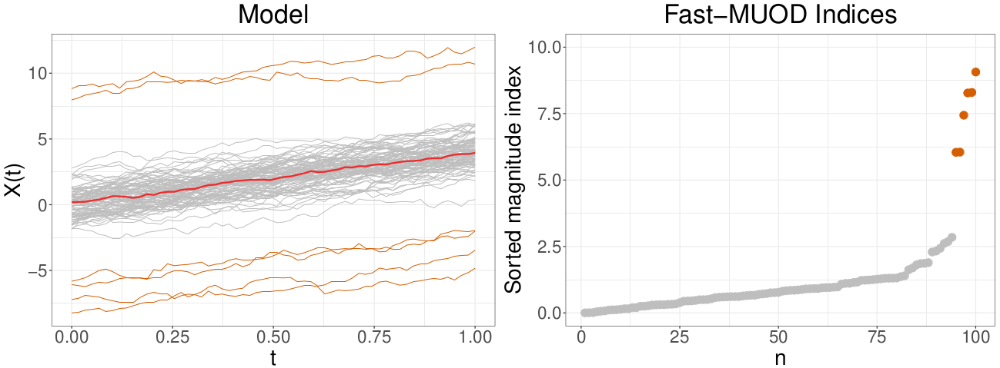
```
Pointwise median in color red
---

# Fast-MUOD

**Illustration (Amplitude Index)**

```{r, eval=T, echo=F, fig.retina = 2, out.width = "100%", fig.align='center'}
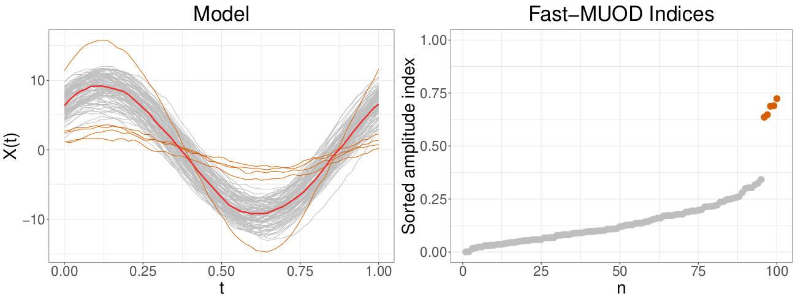
```
Pointwise median in color red
---
# Fast-MUOD

**Illustration (Shape Index)**

````{r, eval=T, echo=F, fig.retina = 2, out.width = "100%", fig.align='center'}
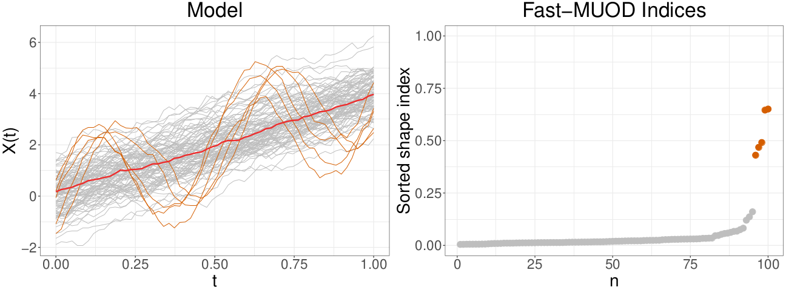
```
Pointwise median in color red

---

# Semifast-MUOD

- Compute the three indices w.r.t. a reference sample drawn from $Y$.

- The sampling proportion $p \in [0,1]$ is fixed.  

- Denote by $X = \{X_i(t)\}_{i = 1}^{n_X}$, the random sample selected from $Y$ without replacement, where $n_X$ is the sample size. 

- We define the Semifast-MUOD shape index of function $Y_i$ w.r.t. to $F_X$, the empirical distribution of $X$ as:
$$I_S(Y_i, F_X) := \left| \frac{1}{n_X} \sum_{j = 1}^{n_X} r(Y_i(t), X_j(t)) - 1 \right|,$$ where $r(Y_i(t), X_j(t))$ is the estimated *Pearson correlation correlation coefficient* between the points of $Y_i(t)$ and $X_j(t)$. 


---
# Semifast-MUOD
- We define the Semifast-MUOD amplitude index of function $Y_i$ w.r.t. to $F_X$ as:
$$I_A(Y_i, F_X) := \left|\frac{1}{n_X} \sum_{j = 1}^{n_X} \beta_j - 1 \right|,$$ where $\beta_j$ is the estimated *slope* of a simple linear regression line between the points of $Y_i(t)$ and ${X}_j(t)$ given by: $$\beta_j = \frac{\text{cov}(Y_i, X_j )}{\text{var}(X_j)}; \ \ \ \ \text{var}(X_j)\ne 0$$


- We define the Semifast-MUOD magnitude index of function $Y_i$ w.r.t. to $F_X$ as:
$$I_M(Y_i, F_X) = \left| \frac{1}{n_X} \sum_{j = 1}^{n_X} \alpha_j\right|,$$ where $\alpha_j$ is the estimated *intercept* of a simple linear regression line between the points of $Y_i(t)$ and $X_j(t)$.


---
# Semifast-MUOD illustration

**Illustration (Magnitude Index):**

```{r, eval=T, echo=F, fig.retina = 2, out.width = "100%", fig.align='center'}
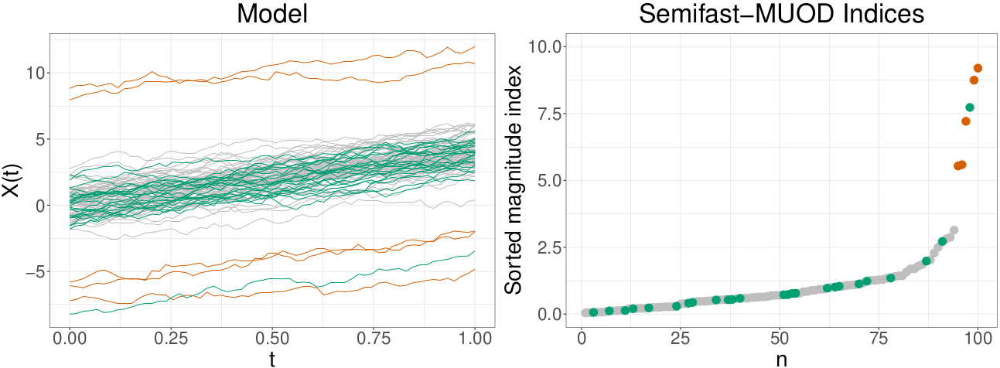
```

Reference sample $\{X_i(t)\}_{i = 1}^{n_X}$ in color green
---

# Semifast-MUOD illustration

- **Illustration (Amplitude Index):**

```{r, eval=T, echo=F, fig.retina = 2, out.width = "100%", fig.align='center'}
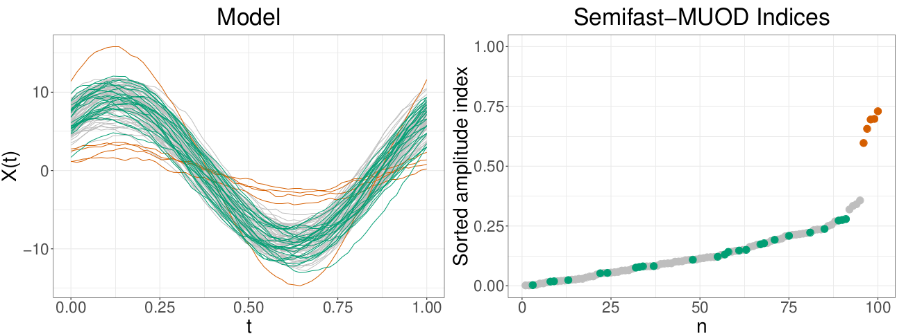
```

Reference sample $\{X_i(t)\}_{i = 1}^{n_X}$ in color green

---
# Semifast-MUOD illustration

- **Illustration (Shape Index):**

````{r, eval=T, echo=F, fig.retina = 2, out.width = "100%", fig.align='center'}
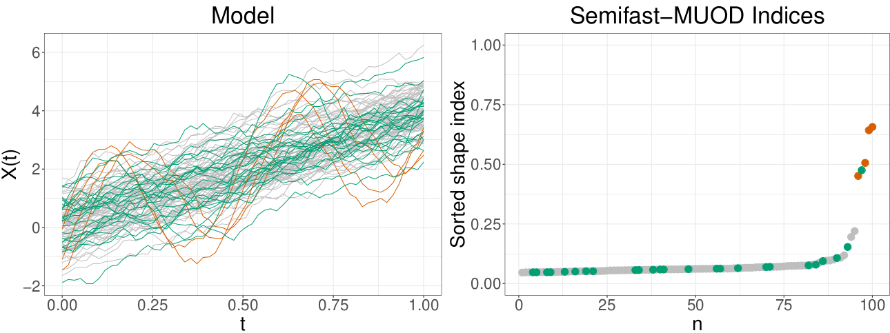
```

Reference sample $\{X_i(t)\}_{i = 1}^{n_X}$ in color green
---

# Next steps...

- For each functional observation $Y_i(t) \in Y$,  compute the three indices $I_A(Y_i), I_S(Y_i)$ and $I_M(Y_i)$. 

- Apply a classical boxplot (individually) to the three univariate data sets: $\{I_A(Y_i)\}_{i = 1}^n$, $\{I_M(Y_i)\}_{i = 1}^n$, and $\{I_S(Y_i)\}_{i = 1}^n$ to separate the indices of the outliers from non-outliers. 

- Obtain the three set of outliers: 
  - Amplitude outliers from the boxplot applied on $\{I_A(Y_i)\}_1^n$.
  - Magnitude outliers from the boxplot applied on $\{I_M(Y_i)\}_1^n$.
  - Shape outliers from the boxplot applied on $\{I_S(Y_i)\}_1^n$.
  
- Classification of the outliers are **not mutually exclusive**, i.e.,
  -an observation $Y_i$ can simultaneously be a shape, amplitude and magnitude outlier.

- The classification into various outlier type is done automatically **without the need for intervention or visualization** (useful for big functional data that are difficult to visualize). 
 
---
# Boxplot cutoff illustration

- Distribution of typical magnitude and amplitude indices with individual boxplots

- **Only right whisker** considered as cutoff

````{r, eval=T, echo=F, fig.retina = 2, out.width = "100%", fig.align='center'}
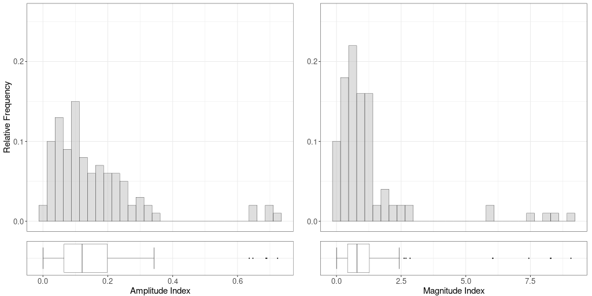

```


---

class: inverse, center, middle

# Simulation and Benchmark Tests

---
# Competing methods from literature

- **OGMBD**:
  - Outliergram method proposed by [Arribas-Gil & Romo (2014)](https://doi.org/10.1093/biostatistics/kxu006)
  - Originally for detecting shape outliers
  - another method (**functional boxplot**) used for detecting magnitude outliers.
- **MS-Plot**:
  - Magnitude shape plot proposed by [Dai & Genton (2018)](https://doi.org/10.1080/10618600.2018.1473781)
  - Very good in detecting shape outliers
  - Sometimes it fails to detect magnitude outliers
  - Amplitude outliers are sometimes not detected
  - Also works for multivariate functional data: $X(t) \in \mathbb{R}^p$.
  - Visualization needed to identify type of outlier
  
- **TVDMSS**:
  - Total Variation Depth and Modified Shape Similarity by [Huang & Sun (2019)](https://doi.org/10.1080/00401706.2019.1574241),
  - Good in detecting shape outliers
  - Computationally intensive
---

# Simulation Models 1 - 2

- Plot of simulation models 5 and 6 <sup>*</sup>: 

- Outliers in orange
````{r, eval=T, echo=F, fig.retina = 2, out.width = "100%", fig.align='center'}
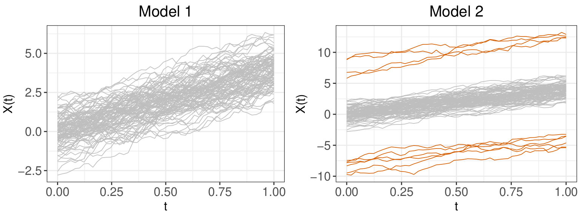
```

.footnote[[*] Image credit: [Ojo et al. (2021)](https://link.springer.com/article/10.1007/s11634-021-00460-9)]

---
# Results Models 1 - 2

- Data were generated from Model 5 and Model 6

- Each data contains 300 curves with 10% outliers. Curves evaluated on 60 domain points

- 500 repetitions. % TPR and FPR are shown with standard deviations

```{r, echo=F}
mm12 <- read.csv("gfx/mm_cut1.csv") 
mm12$method <- c("Fast-MUOD",  "Fast-MUOD-MAG", "Fast-MUOD-SHA", "Fast-MUOD-AMP", "Semifast-MUOD", "OGMBD", "MSPLOT", "TVD" )
mm12$TPR1 <- c(rep("-",8))

mm12 <- mm12[, c(1,5, 2:4)]
names(mm12) <- c("Method", "TPR-Model1", "FPR-Model1 (SD)", "TPR-Model2 (SD)",   "FPR-Model2 (SD)")
knitr::kable(mm12, align = c("l", "c", "c", "c", "c"))
```

---

# Simulation Models 3 - 4

- Plot of simulation models 3 and 4 <sup>*</sup>: 

- Outliers in orange

````{r, eval=T, echo=F, fig.retina = 2, out.width = "100%", fig.align='center'}
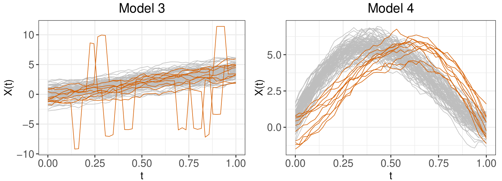
```

.footnote[[*] Image credit: [Ojo et al. (2021)](https://link.springer.com/article/10.1007/s11634-021-00460-9)]
---
# Results Models 3 - 4

- Data were generated from Model 5 and Model 6

- Each data contains 300 curves with 10% outliers. Curves evaluated on 60 domain points

- 500 repetitions. % TPR and FPR are shown with standard deviations

```{r, echo=F}
mm34 <- read.csv("gfx/mm_cut2.csv") 
mm34$method <- c("Fast-MUOD",  "Fast-MUOD-MAG", "Fast-MUOD-SHA", "Fast-MUOD-AMP", "Semifast-MUOD", "OGMBD", "MSPLOT", "TVD" )


names(mm34) <- c("Method", "TPR-Model3 (SD)", "FPR-Model3 (SD)", "TPR-Model4 (SD)",   "FPR-Model4 (SD)")
knitr::kable(mm34, align = c("l", "c", "c", "c", "c"))
```

---
# Simulation Models 5 - 6
- Plot of simulation models 5 and 6 <sup>*</sup>: 

- Outliers in orange

````{r, eval=T, echo=F, fig.retina = 2, out.width = "100%", fig.align='center'}
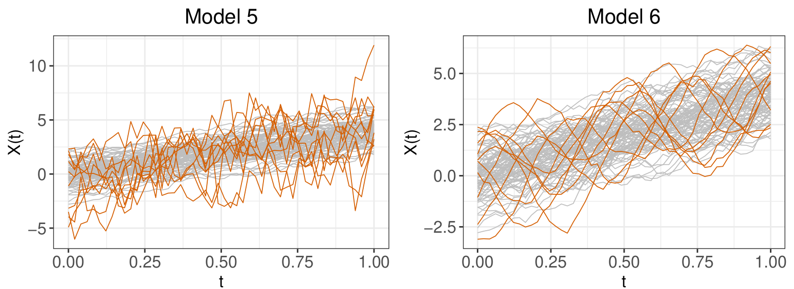
```

.footnote[[*] Image credit: [Ojo et al. (2021)](https://link.springer.com/article/10.1007/s11634-021-00460-9)]

---
# Results Models 5 - 6

- Data were generated from Model 5 and Model 6

- Each data contains 300 curves with 10% outliers. Curves evaluated on 60 domain points

- 500 repetitions. % TPR and FPR are shown with standard deviations

```{r, echo=F}
mm56 <- read.csv("gfx/mm_cut3.csv") 
mm56$method <- c("Fast-MUOD",  "Fast-MUOD-MAG", "Fast-MUOD-SHA", "Fast-MUOD-AMP", "Semifast-MUOD", "OGMBD", "MSPLOT", "TVD" )


names(mm56) <- c("Method", "TPR-Model5 (SD)", "FPR-Model5 (SD)", "TPR-Model6 (SD)",   "FPR-Model6 (SD)")
knitr::kable(mm56, align = c("l", "c", "c", "c", "c"))
```

---
# Simulation Models 7 - 8

- Plot of simulation models 7 and 8 <sup>*</sup>: 

- Outliers in orange

````{r, eval=T, echo=F, fig.retina = 2, out.width = "100%", fig.align='center'}
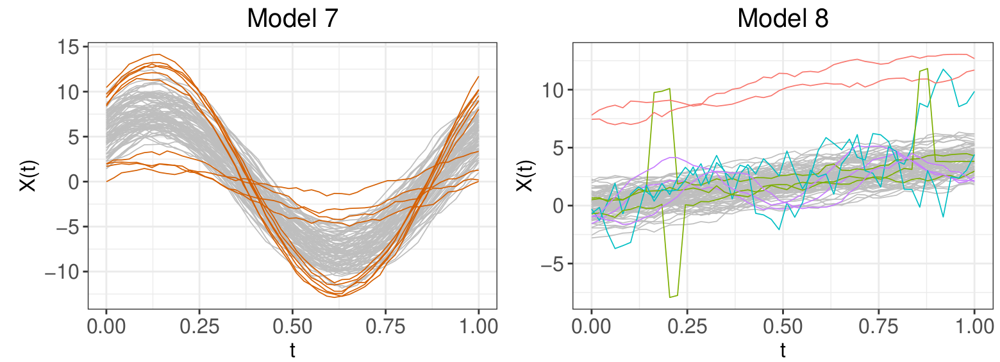
```


.footnote[[*] Image credit: [Ojo et al. (2021)](https://link.springer.com/article/10.1007/s11634-021-00460-9)]
---
# Results Models 7 - 8

- Data were generated from Model 7 and Model 8

- Each data contains 300 curves with 10% outliers. Curves evaluated on 60 domain points

- 500 repetitions. % TPR and FPR are shown with standard deviations

```{r, echo=F}
mm78 <- read.csv("gfx/mm_cut4.csv") 
mm78$method <- c("Fast-MUOD",  "Fast-MUOD-MAG", "Fast-MUOD-SHA", "Fast-MUOD-AMP", "Semifast-MUOD", "OGMBD", "MSPLOT", "TVD" )


names(mm78) <- c("Method", "TPR-Model7 (SD)", "FPR-Model7 (SD)", "TPR-Model8 (SD)",   "FPR-Model8 (SD)")
knitr::kable(mm78, align = c("l", "c", "c", "c", "c"))
```

---
# Computational Time

- We measure the maximum sample size each method can handle under 10s.

- Data generated from Model2 with 100 observed points (on each function) and 5% outliers. 

- Test carried out on a machine with Core i9 8950HK processor (6 cores, 12 threads, up to 4.8GHz) with 32GB RAM.

```{r, echo = F}
inv <- list.files("/home/statimatician/Documents/research_matters/muod_research/muod_submission/submission5_ADAC_revision/time_benchmark_new/inverse_benchmark/", full.names = T)
inv <- lapply(inv, function(x) read.csv(x))
inv <- do.call(rbind, inv)[, -1]

tablv <- data.frame(method = inv$method,
                    max_obs = inv$max_obs,
                    time_taken = inv$time)
tablv <- tablv[c(6, 14, 15, 10, 8, 16), ]

names(tablv) <- c("Method", "Sample Size", "Time (s)")
tablv$Method <- c("Fast-MUOD", "Semifast-MUOD", "Semifast-MUOD25",  "OGMBD", "MSPLOT", "TVD")
rownames(tablv) <- NULL
knitr::kable(tablv, align = c("l", "c", "c"))
```


---
class: inverse, center, middle

# Application: Fast-MUOD

---
# Spanish Weather Data 

- Spanish weather data collected by the "Agencia de Estatal de Meteorologia"

- Contains daily average temperature, precipitation, between 1980-2009.

- Collected from 73 weather stations in Spain

- **Objective** Identify weather stations with different temperature/precipitation curves (outliers)

- Data were first smoothed, Fast-MUOD was then used on the data

- For the temperature curves: 
  - 7 weather stations on the Canary Islands are flagged simultaneously as
amplitude, shape and magnitude outliers
  - 2 pure shape outliers: 1 weather station on the Canary Islands, the other station on the souther tip of Spain
  - 1 pure magnitude outliers: a weather station in Puerto de Navacerrada, Madrid.


---
# Spanish Weather Data

```{r, eval=T, echo=F, fig.retina = 2, out.width = "85%", fig.align='center'}
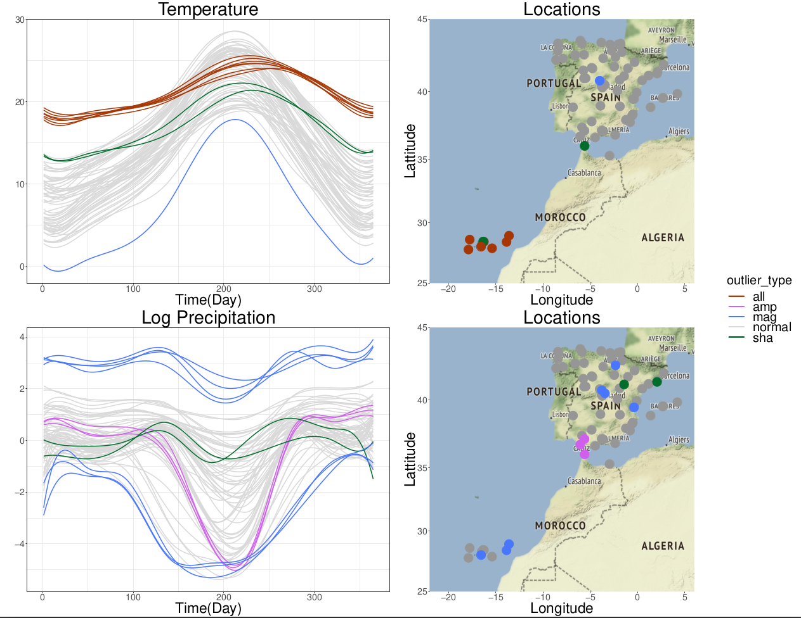
```


---

# World Population Data

- World population data from the United Nations. 
- Yearly total population of 105 countries/regions from July, 1950 to 2015. 
- Functional data is made up of 105 curves observed at 65 domain points. 
- **Objective** Identify countries with unusual population growth between 1950 to 2015. 
- Comparison with previous study [Dai et al. (2020)]() shows similar results.

- 33 **unique countries** detected as outliers: 
  - 3 magnitude outliers (Saudi Arabia, Sudan, Uganda)
  - 15 amplitude outliers (Saudi Arabia, Iraq, Sudan Uganda, Malaysia, Yemen,...)
  - 18 shape outliers (Bulgaria, Latvia, Georgia, Croatia, Estonia, Czech Republic...)
  
- Outlier groups are not mutually exclusive  

---

# World Population Data

```{r, eval=T, echo=F, fig.retina = 2, out.width = "85%", fig.align='center'}
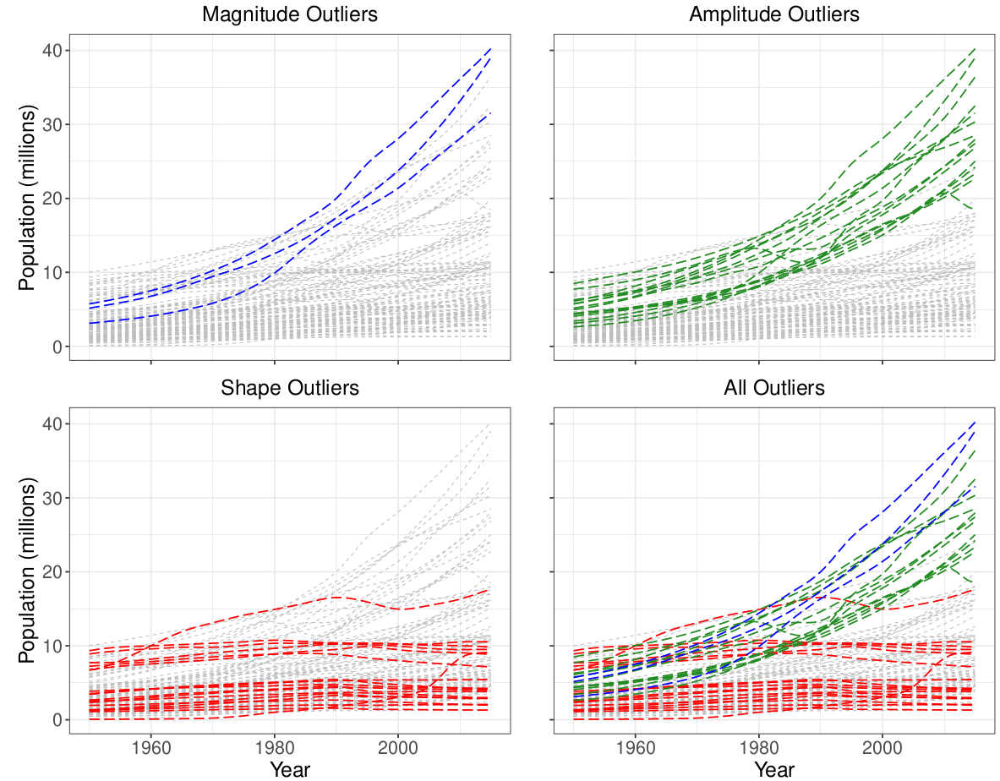
```

---
# Surveillance Video Data

- A surveillance video data named *WalkByShop1front* <sup>*</sup> 

- Filmed by a camera across the hallway in a shopping centre in Lisbon. 

- Shows the front of a clothing store with people walking through the corridor in front of the shop. 

- **Objective** Identify points in video when people pass by the front of the store (outliers).

--

- Video is 94s @ 25FPS which gives a total of $2359$ frames.

- Each of the frame is made up of $384 \times 288 = 110,592$ pixels. 

- We convert the RGB values of each pixels to gray scale

- We consider each frame as a functional data observed on $110,592$ points.

- The constructed functional data is $2359$ curves observed on $110,592$ domain points.

.footnote[[*] Video made availble by  [the CAVIAR project](http://homepages.inf.ed.ac.uk/rbf/CAVIARDATA1/)] 

---
# Surveillance Video: Frame 1

```{r, echo=F, fig.retina = 2, out.width = "70%", fig.align='center'}
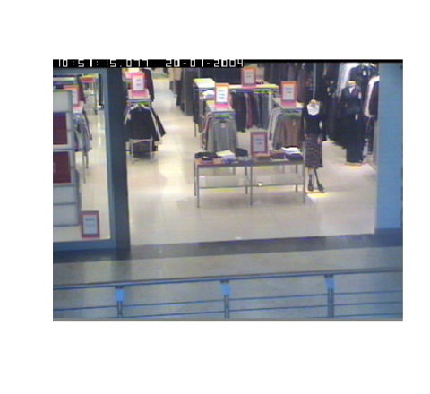
```

---
# Frame 1: Grayscale

```{r, echo=F, fig.retina = 2, out.width = "70%", fig.align='center'}
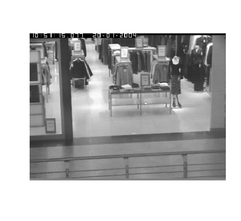
```

---
# Frame 1: Functional Data

```{r, echo=F, fig.retina = 2, out.width = "100%", fig.align='center'}
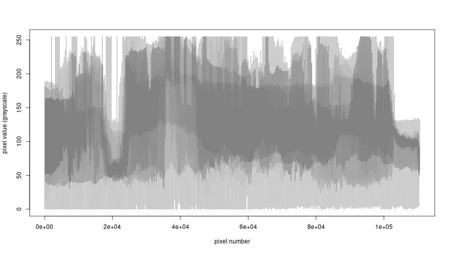
```

---
# Video Data

```{r, echo=F, fig.retina = 2, out.width = "70%", fig.align='center'}
knitr::include_graphics("gfx/video_data_analysis/animation_walkbyshop1.gif")
```

---
# Video Data

<video width="896" height="504">
<source src="gfx/video_data_analysis/animation_walkbyshop1_indices.mp4" type="video/mp4">
</video>

---
# Video Data

```{r, echo=F, fig.retina = 2, out.width = "70%", fig.align='center'}
knitr::include_graphics("gfx/video_data_analysis/animation_walkbyshop2.gif")
```

---
# Video Data

<video width="896" height="504">
<source src="gfx/video_data_analysis/animation_walkbyshop2_indices.mp4" type="video/mp4">
</video>

---
# Video Data Results Summary

- 294 *unique frames* flagged as outliers :
 - 216 shape outliers
 - 206 amplitude outliers
 - 194 magnitude outliers
 
- Outlier classes are not mutually exclusive
- 125 outliers are simultaneously amplitude, magnitude and shape outliers.
- All outliers flagged correspond to frames with people passing by font of store (*no false positive*)

- Some pocket of frames with people were not flagged as outliers (frames with little contrast between the person and the store background).

- Comparison with competing methods:
  - **TVD** flagged all frames as outliers (*after running for 9hrs., compared to 42s for Fast-MUOD*)
  - **MSPLOT** didn't produce any result due to some *computational error*

---

# Frame 2110

```{r, echo=F, fig.retina = 2, out.width = "70%", fig.align='center'}

```

---
#Conclusion and Summary

- High level description of Functional Data Analysis (FDA)

- Description of outliers in functional setting

- We proposed two methods:
  - **Fast-MUOD**
  - **Semifast-MUOD**
  
- Both methods are **unbelievably simple**, yet effective.

- Type of outlier is provided by the methods automatically.

- **Fast-MUOD** is scalable. 
  
- We show good performance of the methods, especially **Fast-MUOD** using various simulated and real data sets.

---
class: center, middle

**Thanks!** 

Find me at...

[`r icons::fontawesome("github")` @otsegun](http://github.com/otsegun)  
[`r icons::fontawesome("paper-plane")` oluwasegun.ojo@imdea.org](mailto:oluwasegun.ojo@imdea.org)


